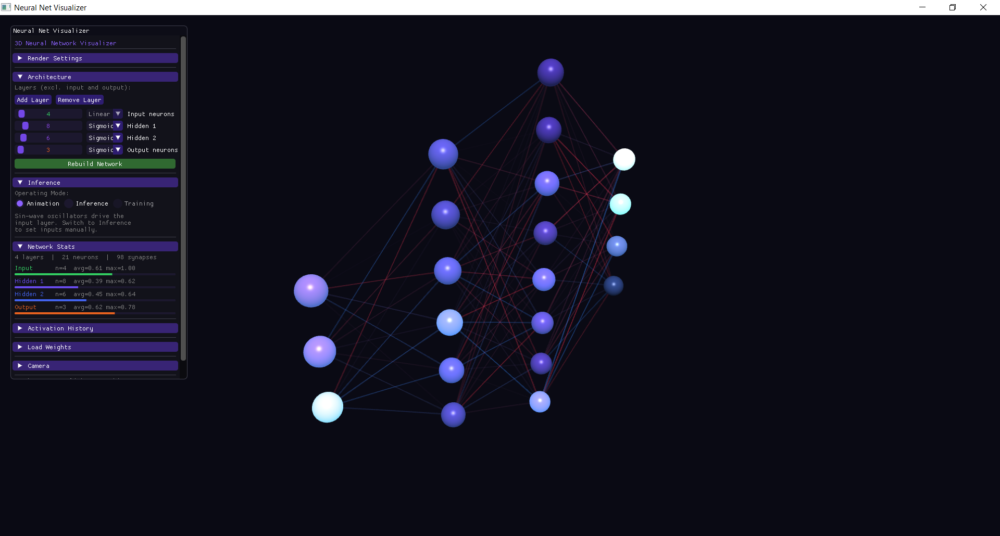
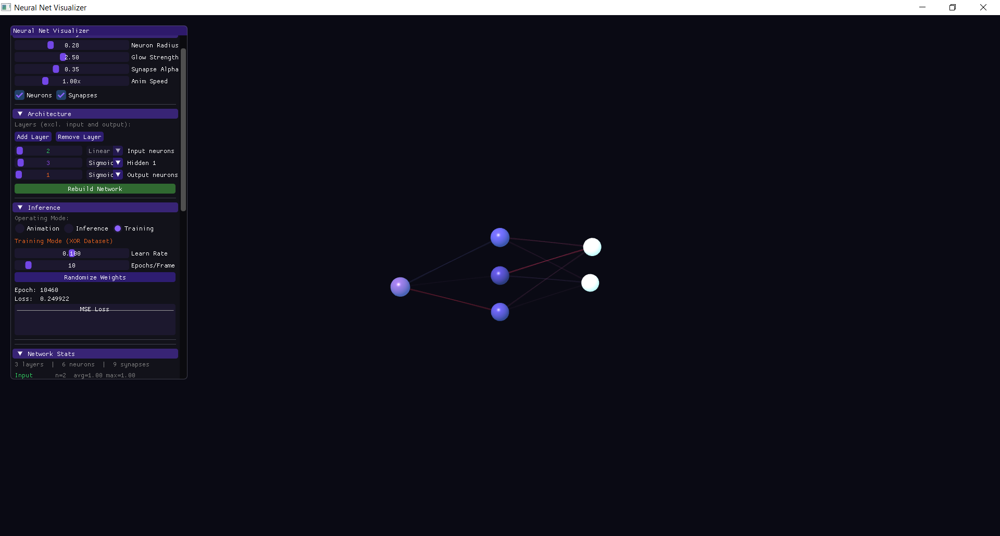
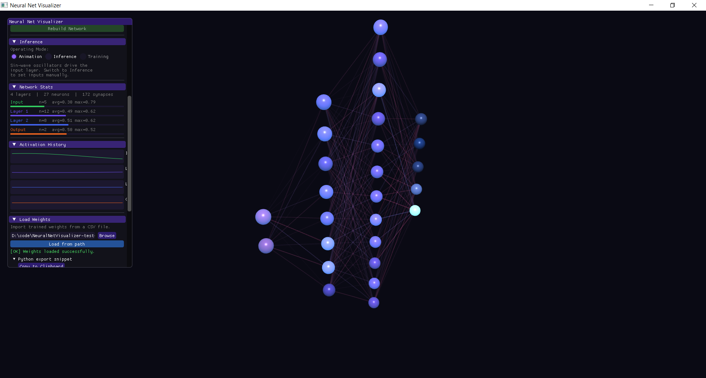

# NeuralNetVisualizer

An interactive, C++ and OpenGL-based educational sandbox for exploring Multi-Layer Perceptrons (MLPs) in 3D. Designed to give students, developers, and hobbyists a hands-on visual intuition for how neural networks are structured, how data propagates through them, and how backpropagation shapes the weights over time.

> **What this tool does:**
> - Explore a 3D visualization of a **fully-connected, feed-forward network** rendered with Blinn-Phong shading and emissive glow.
> - **Orbit and zoom** the camera freely around the network.
> - **Adjust architecture on the fly**: add/remove layers, change neuron counts, and select per-layer activation functions (Sigmoid, ReLU, Tanh, Linear).
> - **Animation Mode**: watch sinusoidal oscillators drive the input layer, propagating activation through the network continuously.
> - **Inference Mode**: set input values manually with sliders and get real-time output readouts. Optionally trigger a **step-by-step propagation animation** that highlights each layer as it computes.
> - **Training Mode (XOR)**: engage real backpropagation on the XOR dataset. Watch weights and neuron colors update live as the network learns. Monitor MSE loss with a rolling plot.
> - **Import Weights**: load a complete PyTorch model's weights and biases from a CSV file. The visualizer rebuilds its architecture to match and locks the sliders.
> - **Visual weight encoding**: synapse color (blue = positive, red = negative) and opacity (proportional to |weight|, normalised to the network's maximum) encode connection strength at a glance.
> - **Activation coloring**: neuron color blends from blue (low activation) to red (high activation) in real time.



## Contents
- [Technical Scope](#technical-scope)
- [Prerequisites](#prerequisites)
- [Setup & Build Instructions](#setup--build-instructions)
- [Usage](#usage)

## Technical Scope

This tool focuses on **Multi-Layer Perceptrons (MLPs)** — fully connected, feed-forward networks. It is an educational sandbox, not a production ML debugging suite.

- **Architectures**: Fully-connected layers only. No convolutional, recurrent, or attention mechanisms.
- **Training**: A built-in XOR demo with real gradient descent (forward pass → backprop → weight update). The training loop is intentionally minimal — it is a teaching aid, not a training framework.
- **Rendering**: OpenGL 3.3 Core Profile. Modern shader pipeline (VAOs, VBOs, GLSL). No legacy fixed-function calls.

## Prerequisites

- **C++17** or newer
- **CMake** (3.21+)
- A C++ Compiler (MSVC on Windows, GCC/Clang on Linux/macOS)
- **vcpkg**: This project uses a vcpkg manifest (`vcpkg.json`) to manage dependencies.

Dependencies (handled automatically via vcpkg):
- [GLFW](https://www.glfw.org/)
- [GLAD](https://glad.dav1d.de/)
- [GLM](https://github.com/g-truc/glm)
- [Dear ImGui](https://github.com/ocornut/imgui)

## Setup & Build Instructions

### 1. Clone the repository
```cmd
git clone https://github.com/Muneeb-Almoliky/NeuralNetVisualizer.git
cd NeuralNetVisualizer
```

### 2. Configure the project using CMake
Because this project uses `vcpkg` for package management, you need to provide the vcpkg toolchain file during the CMake configuration step.

> **Note:** If you are using Visual Studio or VS Code with the CMake Tools extension, it will likely detect `vcpkg.json` and handle this automatically.

From the command line (assuming `vcpkg` is installed and `VCPKG_ROOT` is set):
```cmd
cmake -B build -S . -DCMAKE_TOOLCHAIN_FILE="%VCPKG_ROOT%\scripts\buildsystems\vcpkg.cmake"
```

### 3. Build the application
```cmd
cmake --build build --config Release
```

### 4. Run it
```cmd
# Windows
.\build\Release\NeuralNetVisualizer.exe
```

## Usage

### 1. Navigating the 3D View
- **Left Click & Drag**: Orbit the camera around the network.
- **Scroll Wheel**: Zoom in and out.

### 2. Architecture Panel
The application starts with a `4 → 8 → 6 → 3` network. Use the **Architecture** panel to:
- Add or remove layers.
- Adjust neuron counts per layer (1–64).
- Set per-layer activation functions (Sigmoid, ReLU, Tanh, Linear).
- Click **Rebuild Network** to apply changes.

> **Note**: The architecture sliders lock when weights are imported from a CSV. Use **Unlock & Reset Architecture** to restore manual control.

### 3. Operating Modes

Switch between three modes using the radio buttons in the **Inference** panel:

| Mode | Description |
|---|---|
| **Animation** | Sinusoidal oscillators drive the input layer continuously. Good for exploring the network structure. |
| **Inference** | Set input values manually. Results update instantly. Click **Propagate Step-by-Step** to animate the forward pass layer-by-layer. |
| **Training** | Runs real gradient descent on the XOR dataset. Requires a `2 → ... → 1` architecture. Adjust learning rate and epochs per frame. |



### 4. Importing Trained Weights

You can import weights and biases from a trained PyTorch MLP.



1. Export your model weights to a `weights.csv` file using the Python snippet in the **Load Weights** panel (or copy it from below).
2. In the visualizer, open the **Load Weights** panel.
3. Click **Browse** to pick the file, or type the path and click **Load from path**.
4. The visualizer rebuilds its architecture to match your model and locks the manual sliders.

#### Python Export Snippet
```python
import torch, csv

m = torch.load('model.pth', map_location='cpu')
rows = []
state = m.state_dict()

for k, v in state.items():
    if 'weight' in k and len(v.shape) == 2:
        out_f, in_f = v.shape
        b_key = k.replace('weight', 'bias')
        b = state[b_key].detach().cpu().numpy().tolist()
        rows.append([in_f, out_f] + b + v.detach().cpu().numpy().flatten().tolist())

with open('weights.csv', 'w', newline='') as f:
    w = csv.writer(f)
    for r in rows:
        w.writerow(r)
```
